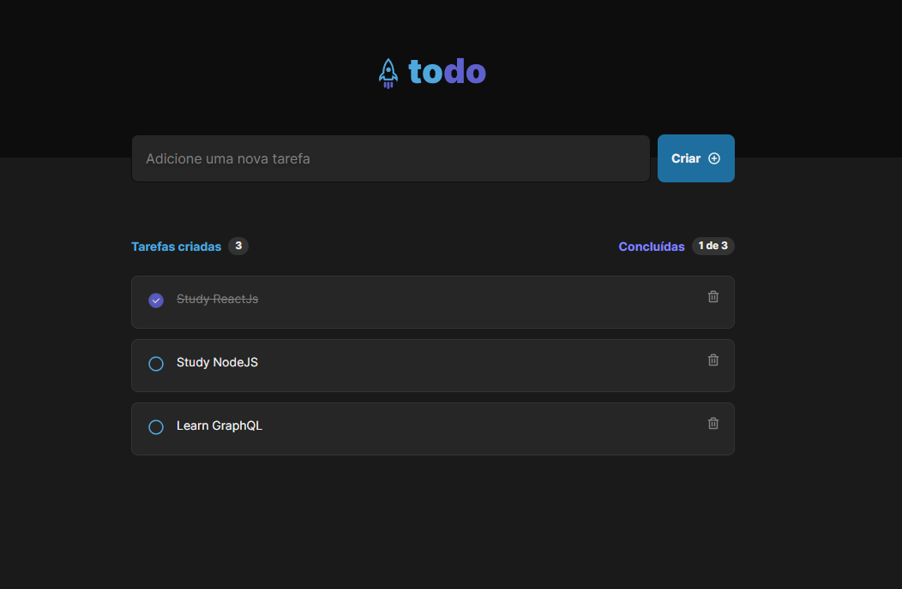

<p align="center">
  

  
 
  <a href="https://github.com/eduardoluizdev/ignite-reactjs-todo/commits/master">
    
  </a>
    
   
   <a href="https://github.com/eduardoluizdev/ignite-reactjs-todo/stargazers">
    
  </a>

  <a href="https://ignite-reactjs-todo.vercel.app">
    
  </a>
</p>

<h1 align="center">
    
</h1>

<p align="center">
  <a href="#about">About</a> •
  <a href="#features">Features</a> •
  <a href="#how-it-works">How it works</a> • 
  <a href="#tech-stack">Tech Stack</a> • 
  <a href="#user-content-license">License</a>
</p>

<div align="center"> 
	
</div>

## About

📃 - Todo app made with React.

Project developed during the ReactJS Ignite Course in its second version from [Rocketseat](https://www.rocketseat.com.br/ignite).

---

## Features

- [x] Create a todo
- [x] Delete a todo
- [x] Mark a todo as completed

---

## How it works

### Pre-requisites

Before you begin, you will need to have the following tools installed on your machine:
[Git] (https://git-scm.com), [Node.js] (https://nodejs.org/en/).
In addition, it is good to have an editor to work with the code like [VSCode] (https://code.visualstudio.com/)

#### Running the web application (Frontend)

```bash

# Clone this repository
$ git clone git@github.com:bfukumori/ignite-reactjs-todo.git

# Access the project folder in your terminal
$ cd ignite-reactjs-todo

# Install the dependencies
$ npm install

# Run the application in development mode
$ npm run dev

# The app will open on the port: 3000 - go to http://localhost:3000/

```

---

## Tech Stack

The following tools were used in the construction of the project:

#### **Website** ([React](https://reactjs.org/) + [TypeScript](https://www.typescriptlang.org/))

- **[PhosphorIcons](https://phosphoricons.com/)**
- **[Vite](https://vitejs.dev/)**

---

## License

This project is under the license [MIT](./LICENSE).

---
